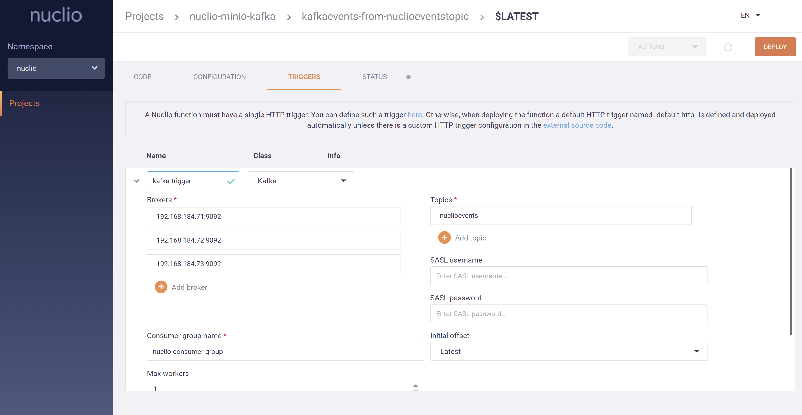

### Nuclio is scalable Serverless functions to get events from Kafka topics which events comes through S3 buckets.

#### Start nuclio dashboard:
```bash
$ docker run -itd -p 8070:8070 -v /var/run/docker.sock:/var/run/docker.sock -v /tmp:/tmp --name nuclio-dashboard quay.io/nuclio/dashboard:stable-amd64
```

#### It will start 2 containers for dashboard `nuclio-dashboard` and storage read `nuclio-local-storage-reader`. Each serverless function will start another container environment using docker socket file inside of the `nuclio-dashboard` container:
```bash
$ docker ps | awk '{ print $(NF) }'
NAMES
nuclio-local-storage-reader
nuclio-dashboard
```

#### We can deploy new function from web dashboard or or we can use `nuctl` command from console. To use `nuctl` command line tool use the following command:
```bash
$ curl -s https://api.github.com/repos/nuclio/nuclio/releases/latest \
			| grep -i "browser_download_url.*nuctl.*$(uname)" \
			| cut -d : -f 2,3 \
			| tr -d \" \
			| wget -O nuctl -qi - && chmod +x nuctl && mv nuctl /usr/bin/
```

#### Output from dashboard:


#### We can go to the web dashboard and create new Project. Then inside of this project create new Python function and then export as yaml. After that go to the console and create some folder with name for example `nuclio-serverless-function` and inside of this folder create file with name `function.yaml`. At the end copy content of yaml from dashboard to inside of `function.yaml` file. All stuff configured in the `nuclio-serverless-function`. Go this folder and execute the following command:
```bash
$ cd nuclio-serverless-function
$ nuctl deploy --path .
```

#### After execution of the deploy command we can see the container with name `nuclio-nuclio-send-email-if-pdf-uploaded-to-s3`:
```bash
$ docker ps | grep pdf
f5f4fe0b43b8   nuclio/processor-send-email-if-pdf-uploaded-to-s3:latest   "processor"              8 minutes ago    Up 8 minutes (healthy)    0.0.0.0:49153->8080/tcp          nuclio-nuclio-send-email-if-pdf-uploaded-to-s3
```

#### The `function.yaml` have important keys which explaining usage of serverless functions. In the key `handler: "lambda_function_file:handler_function_name"`, `lambda_function_file` is the name of the main serverless code file and `handler_function_name` is the function name which will get 2 parameters `context` and `event`. `runtime` is the environment where our serverless function will work(`nuclio` starts docker in docker to run our function). In the `commands` key we can run commands inside of our container to get dependencies of our python code. In the `brokers` we must define list of the KAFKA node IP addresses, `consumerGroup` the name of the consumer group which we have created before and `topics` the name of the Kafka topic where will be listened for the events.
- `function.yaml` file name must be exactly as this because `nuctl` command search this. 

#### To test just execute `python3 upload-to-minio.py` file and look at the docker logs with the following command:
```bash
$ docker logs -f nuclio-nuclio-send-email-if-pdf-uploaded-to-s3
```
